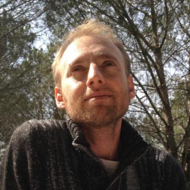

# 360&deg; - Web Development From a Bird's View
## Hello, We Are Moris & Serge
### We provide a unique blend of experience, creativity and humanity to realize your digital product while staying sane and happy.

***

Currently <b>considering new projects</b> for Q4, 2015

<a class="Button" href="#contact">Hire Us!</a>

***

#### We work from one of the most beautiful places in the world: Hararit, Israel. [Come visit](#contact).

Hararit

***

#### Moris Oz

A Multi-Disciplinary Software Engineer with over 16 years of hands-on experience in technology ranging from low-level TCP/IP through Computer Graphics (2D/3D) to Web Back-end development.

[More (LinkedIn)](https://il.linkedin.com/in/morisoz)

*Moris is also a psychotherapist, a happy husband and father, and more recently an organic farming hobbyist.*

#### Serge Krul

A UX/Front-end Engineer, tech-leader, trainer and speaker with over 8 years of experience. Serving as VP R&D for one of Israel's most prominent UX agencies: [Netcraft](http://netcraft.co.il/), and as an Education Director for [Netcraft Academy](http://netcraftacademy.co.il).

[More (LinkedIn)](https://il.linkedin.com/in/sergekrul)

*Serge lives a happy life with his beautiful wife and kids, and keeps dreaming about his musical pursuits.*

***

<a class="Button" href="#contact">Hire Us!</a>

***

## We Do

- Development of large-scale Web/Mobile Sites and Applications
- UX, Design and Branding
- Consulting and Training

We provide full support, PM and supervision in all projects.

In cases where reinforcement is needed we collaborate with wonderful, cherry-picked people whom we trust.

[More](soon)

***

## Our Clients

- Cisco
- SanDisk
- EMC
- Comverse
- NICE
- Amdocs
- Applied Materials

[Projects & Case Studies](soon)

***

## People Who've Worked With Us Say

### Igal Mariasin, *ASIC Verification Team Leader at SanDisk*

> "Moris is an outstanding consultant who continuously exceeds the expectations set for his position." -- [LinkedIn]()

### Andrew Zusman, *VP Product at Skyrise & Head of UX and Research at Velocis*

> "Serge's commitment to excellence is unmatched. It was a pleasure to learn from him and to work with him." -- [LinkedIn]()

### Yinon Brosh, *Group manager and Architect at Tufin Technologies*

> "Serge is a true web professional. He constantly worked to improve our code and technologies as a developer and as a manager he successfully guided his team member to good results." -- [LinkedIn]()

### Dan Fuchs, *Electron Beam Technologist at Applied Materials*

> "Using his broad experience Moris always supplied us with first-class software and consistent support from start to end. Moris is a great team player and gave color and livlihood to the project." -- [LinkedIn]()

***

	<h2>We'd Love to Hear from You!</h2>
	<ul>
		<li><a href="mailto:moris.oz@gmail.com">Moris @ 360&deg;</a></li>
		<li><a href="mailto:sergekrul@gmail.com">Serge @ 360&deg;</a></li>
	</ul>
	
Currently <b>considering new projects</b> for Q4, 2015

